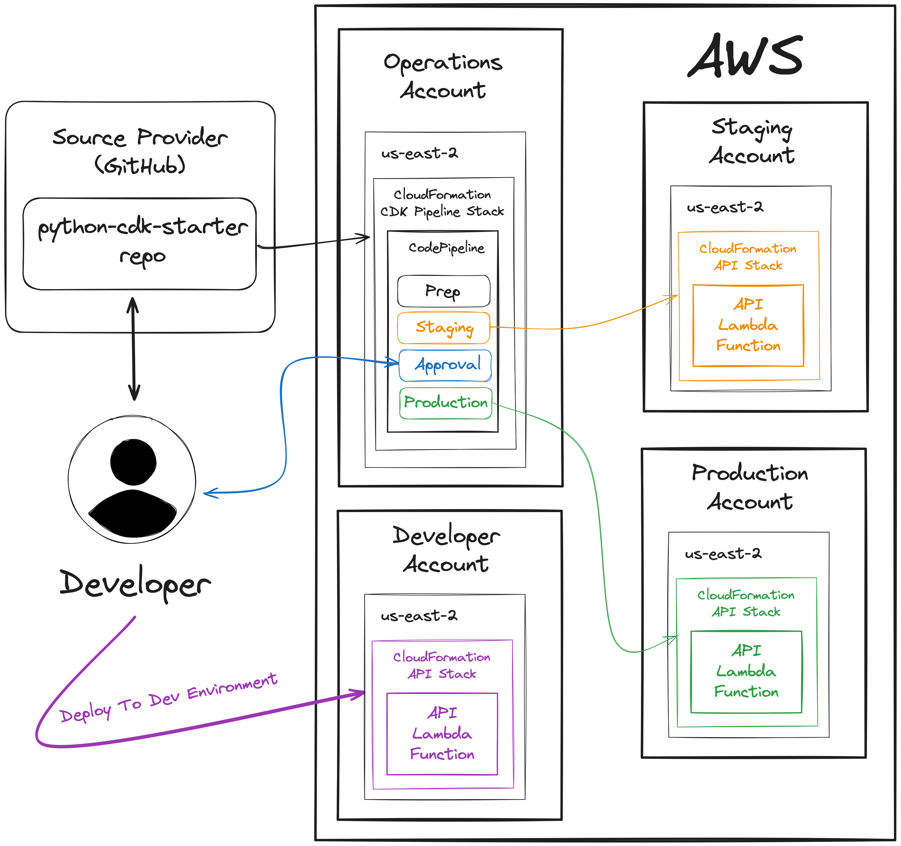

# Python CDK Starter Kit
This is a starter project for developing Python-based CDK applications. It's inspired by:

- [AWS CDK Best Practices](https://docs.aws.amazon.com/cdk/latest/guide/best-practices.html)
- [AWS Cross Account Deployment](https://aws.amazon.com/blogs/mt/cross-account-deployments-aws-control-tower-environment/)

The service it deploys is a simple [Flask](https://flask.palletsprojects.com/en/3.0.x/) API within an AWS Lambda Function URL. Here is a high-level diagram of the architecture:

To run this project locally and contribute to it, see the [CONTRIBUTING](CONTRIBUTING.md) doc.

To deploy this project to AWS, see the [INSTALL](INSTALL.md) doc.
